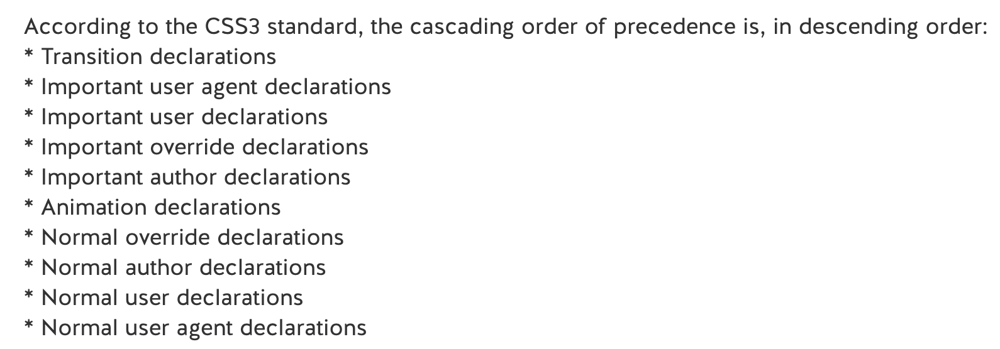

# Structure a CSS file by using CSS selectors

## Objectives
- reference elements correctly
- implement inheritance
- override inheritance using !important
- style an element using pseudo-elements and pseudo-classes

## See this explanation of calculating specificity:
https://www.html5rocks.com/en/tutorials/internals/howbrowserswork/#Specificity

Note: Cascading in Cascading Style Sheets means that the last definition for a certain selector is the one used.

## Reference elements correctly

Try this game: https://flukeout.github.io/

\* = all elements. e.g. `#footer > *` would select all elements inside the id=footer

`div + p` select first y after an x
`div ~ p` select all y after x

[href] would select all elements with the href attribute
[href='#'] would select all elements with the href attribute = '#'
[href^='https'] would select all elements with the href attribute value starting https
[href$='.com'] would select all elements with the href attribute value ending .com
[href*='google'] would select all elements with the href attribute value containing "google"

`ul li:first` would select the first li in ul elements
`ul li:last` would select the last li in ul elements

`p:first-of-type` would select first p element
`p:last-of-type` would select last p element

`plate > apple:only-of-type` selects the apples that are the only apples in a plate

`div:empty` selects div elements with no children

`apple:not(.small)` selects all apples that don't have the class `small`

## The 'Cascading' in cascading style sheets

If two rules conflict then the last one declared in the CSS file is the one used:

```css
h1 {
  color: red;
}
h1 {
  color: blue;
}
```

Outcome: h1 elements will be blue

BUT... that's only true if the rules have the same specificity. A rule that's more specific will not be overwritten by a rule that comes after it in a CSS file

```css
body h1 {
  color: red;
}
h1 {
  color: blue;
}
```

Outcome: h1 elements (in the body, though where else would they be?) will be red

## Implementing inheritance

Some properties inherit and some don't. E.g. color will inherit, border or width will not.

```css
ul {
  color: purple; //inherited by li
  height: 400px; //not inherited by li
}
```

Inheritance can be stopped by the use of more specific rules, e.g. if color is set for a ul all li elements will inherit it, unless some li elements have a class, id, inline style on them that over-rides the inherited CSS styles.

There could be a situation where multiple rules may be cascading down and have the potential to affect a given element. How is one rule selected as the winner? This is done by calculating its specificity score:

[Specificity](https://css-tricks.com/specifics-on-css-specificity/)
```
style attribute
|     ID
|     |    (pseudo)class/attr
\/    \/   \/   \/elements
[ ], [ ], [ ], [ ]
```
e.g. `ul#nav li.active a`
3 elements
1 ID
1 class

Score: 0,1,1,3

vs `ul#nav li a` would be Score: 0,1,0,3 and would be over-ruled by the rule above.

# Override inheritance using !important

!important at the end of a CSS rule is like adding a fifth column on the far left of the above scores.

!important flags mean CSS rules always win. Only way it loses is if another competitor rule is declared later in the document and the CSS rule would have greater specificity when compared without !important flags.

# Multiple sources of styles: browsers, users, and authors

CSS rules can come from:
* **the user-agent/browser**; the default styling of a page that contains no styles of its own
* **the user**; users may apply custom CSS to pages in their browser, e.g. to enhance accessibility
* **the auther**; the webpage itself will likely have its own CSS rules, including a combination of:
  - inline styles : style attribute in element opening tags
  - embedded styles : <style> tags
  - external styles (`<link rel="stylesheet"type="text/css" href="theme.css">`)

There's a kind of inverted pyramid when it comes to precedence of styles from these different sources. It can be divided into styles with and without `!important`:

Precedence, without `!important`:
1) Author CSS
2) User CSS
3) User-agent/browser CSS

This makes sense; browser styles are the bare minimum. If an author has set styling then it's likely important to the UX and needs to be upheld.

Precedence, _with_ `!important`:
1) User-agent/browser CSS
2) User CSS
3) Author CSS

This also makes sense; if a browser has rules set as !important then they must be fundamental to the browser rendering things sensibly. Also, if a user has set important CSS then that should be respected; it could be needed for accessibility purposes.

## More detail on precedence of style sources



# Styling elements based on pseudo-elements and pseudo-classes

Examples:

```CSS
a:hover {
  //styles specifically for links being hovered
}
```

```CSS
p:first-letter {
  font-family: cursive;
  font-size: 3em;
  text-shadow: 2px 2px red;
}
```

## Interactions of rules

These two blocks of CSS result in different behaviours due to the ordering of rules. The `:visited` pseudo-class rule overrules styles assigned using the `:hover` pseudo-class, because the `:visited` rule comes later in the styles and has the same specificity.

Case 1: when hovering over visited links the text is purple on a black background
```css
a:link {
  color: blue;
}
a:hover {
  color: white;
  background-color: black;
}
a:visited {
  color: purple;
}
```

Case 2: when hovering over visited links the text is white on a black background
```css
a:link {
  color: blue;
}
a:visited {
  color: purple;
}
a:hover {
  color: white;
  background-color: black;
}
```
